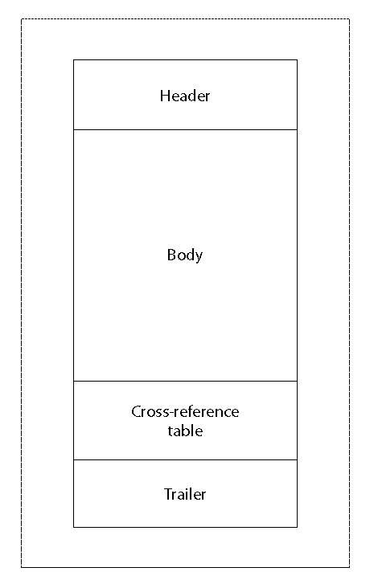
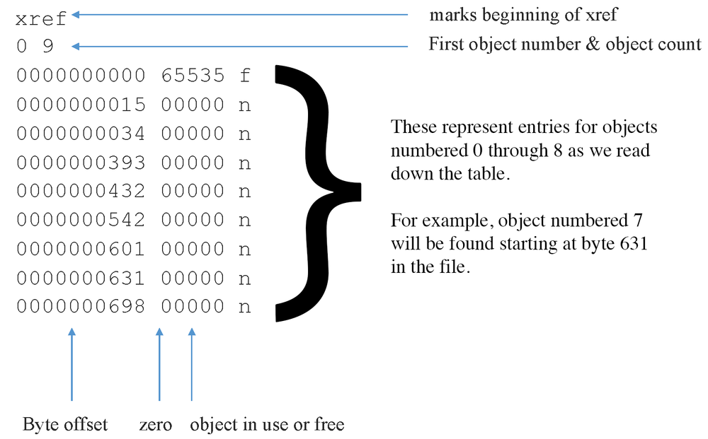
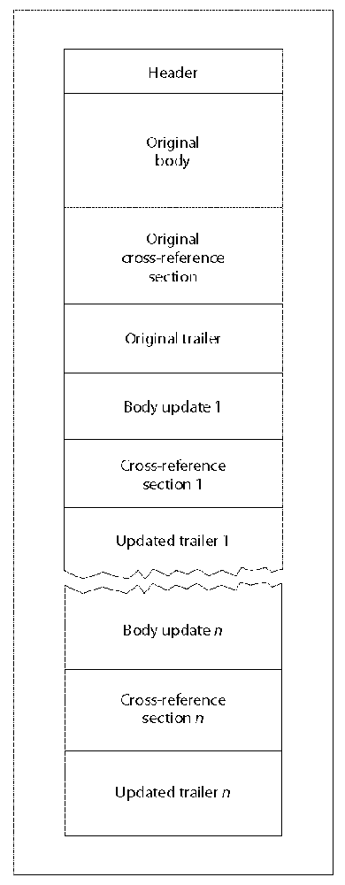
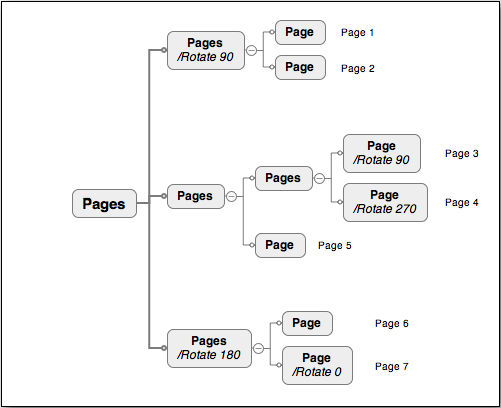
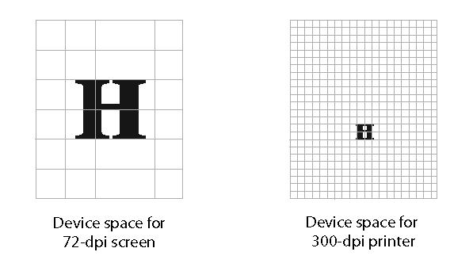
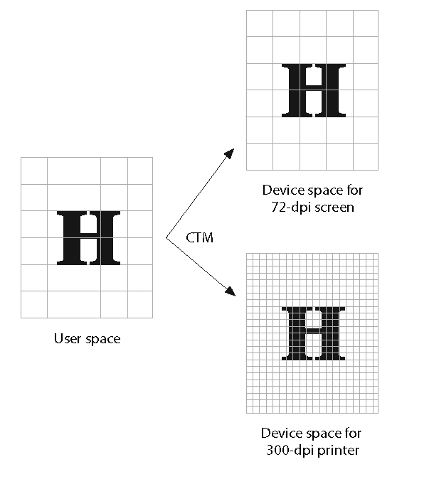
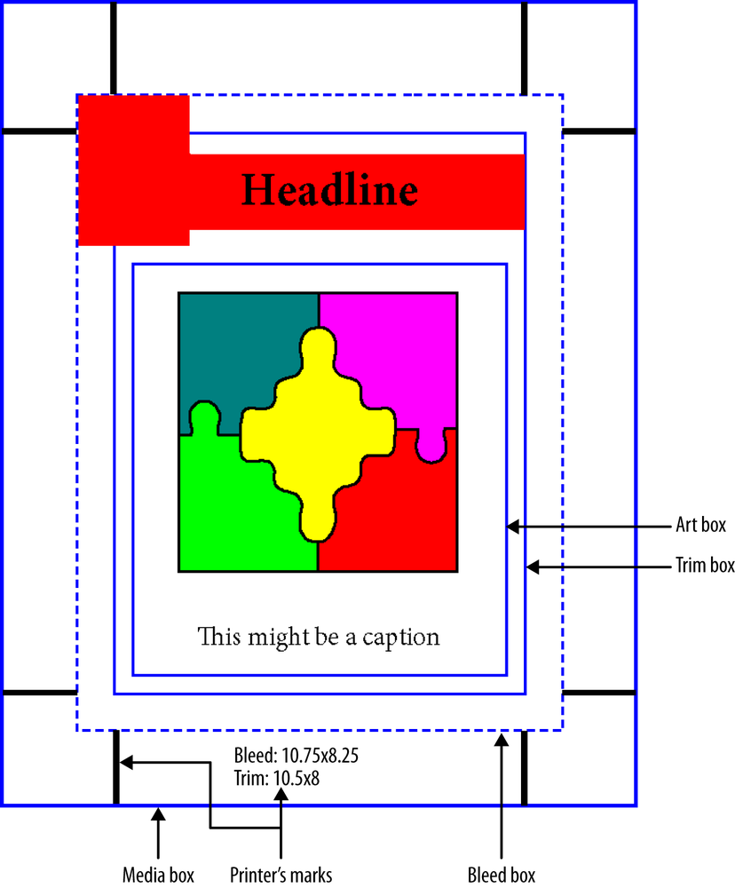

# PDF语法（PDF Syntax）

我们会从构建PDF文件格式的基础模块开始了解PDF。通过这些模块，我们可以了解到PDF的页面内容是如何构建出来的。

## PDF对象（PDF Objects）

PDF文件的核心部分是一系列“事物”，PDF标准（ISO 32000）将这些“事物”称为对象（Object），也叫COS对象。

> COS是Carousel Object System的缩写，指的是Adobe的Acrobat产品的原始代号。

这些不是“面向对象编程”意义上的对象，而是构成PDF的基础模块。这些对象有九种类型：空值、布尔值、整数、实数、名称、字符串、数组、字典和流。

接下来让我们看看这些每一种对象类型，它们是如何存在于PDF文件中的。以及如何使用这些对象去组成更高级别的结构，最终构成一个PDF文件。

> ***译者注*** *：这里提到的对象是有些误导含义的，大概可以理解成面向对象编程中的* ***字面量*** *或者是* ***对象本身*** *，后面介绍的* ***间接对象*** *比较接近面向对象编程中的引用。*

### 空值（Null）对象

空值对象，实际写入到文件中的时候，就只是四个字符——“null”。它是缺失值的同义词，这就是为什么实际上很少在PDF中看到一个空值对象。如果真的有使用空值对象的需要，请务必仔细查阅ISO 32000，了解其处理的微妙之处。

### 布尔值（Boolean）对象

布尔对象是表示真假的逻辑值，并在PDF中相应地表示为**true**或**false**。

> 一般在编写PDF的时候，会一直使用**true**或**false**。但是在阅读或解析PDF的时候，有些写得不好的PDF可能会使用其他大写形式，包括前导大写（True or False）或全部大写（TRUE or FALSE）。

### 数字（Numeric）对象

PDF支持两种不同类型的数字对象——整数（integer）和实数（real）—— 分别代表它们在数学上的等价物。旧版本的PDF曾经声明过Adobe以前曾经颁布过的实施限制，但这些限制不应再被视为文件格式限制（也不应被视为任何供应商的任何特定实施的限制）。

> 虽然PDF支持64位数字（以便支持非常大的文件），但大多数PDF实际上并不需要它们。但是阅读PDF的时候，可能确实会遇到64位数字，因此请做好准备。

整数数字对象由一个或多个十进制数字组成，前面可以带有一个符号，表示该值是一个符号量（以10为基数）。示例 1-1 显示了一些整数示例。

```
示例 1-1 整数

1
-2
+100
612
```

实数值对象由一个或多个十进制数字组成，带有一个可选符号和一个前导、尾随或嵌入的句点，表示有符号的实数值。与PostScript不同，PDF不支持科学或指数格式，也不支持非十进制数。

> 虽然术语“实数”在PDF中用于表示对象类型，但实际上的实现可能使用双精度数（*double*）、浮点数（*float*）甚至定点数（*fixed point*）。由于实现可能不同，小数的位数也可能不同。因此，出于可靠性和文件大小的考虑，建议不要写入超过四位小数。

示例 1-2 显示了一些实数示例。

```
示例 1-2 实数

0.05
.25
-3.14159
300.9001
```

### 名称（Name）对象

PDF中的名称对象是一种特定的字符序列（除了字符代码0，也就是ASCII中的null），通常用于有一组固定值的情况。PDF中的名称对象的形式是“/”字符（斜线分隔符）后跟着一个UTF-8的字符串。对非常规的字符则使用特殊编码形式，非常规字符是指那些定义在0x21（!）到0x7E（~）范围之外的字符，以及任何空白字符（参见表 1-1，后面空白字符章节）。这些非常规字符以#（数字符号）开头，然后是字符的两位十六进制代码。

大多数名称对象由于其独特性，都已经在ISO 32000中预先定义了，或者是从外部数据（例如字体或颜色名称）中派生而来。

> 如果有需要创建自己的，并且是不基于外部数据的自定义名称（例如私有元数据），则必须遵循ISO 32000-1:2008附录E中定义的二级名称规则，才有可能被视为有效的自定义名称。二级名称是以ISO注册的四字符前缀开头，后跟下划线（_），然后是键名。示例 1-3 末尾包含一个示例。

```
示例 1-3 名称

/Type
/ThisIsName37
/Lime#20Green
/SSCN_SomeSecondClassName
```

### 字符串（String）对象

PDF文件中的字符串是一系列（零个或多个）8位字节，可以是括在括号中的文字字符，或用尖括号（< 和 >）括起来的十六进制数据。

文字字符串由括在括号中的任意数量的8位字符组成。我们使用反斜杠（\）对像不平衡括号 ( ) ) 和反斜杠（\）这样的特殊字符做转义处理。此外，反斜杠可以还与特殊的\ddd符号一起使用来指定其他字符值。

文字字符串有几种不同的种类：

#### ASCII

仅包含ASCII字符的字节序列。

#### PDFDocEncoded

根据PDFDocEncoding（ISO 32000–1:2008, 7.9.2.3）编码的字节序列。

#### 文字（Text）

编码为PDFDocEncoding或UTF-16BE（带有前导字节顺序标记）的字节序列。

#### 日期（Date）

在ISO 32000–1:2008, 7.9.4中描述过的，格式为`D:YYYYMMDDHHmmSSOHH'mm`的ASCII字符串。

> Date作为一种字符串，在PDF 1.1版本中被添加进来。

可以在尖括号之间写入一系列十六进制数字（0-9，A-F），这对于在字符串对象中包含更多可读的任意二进制数据或Unicode值（UCS-2或UCS-4）非常有用。其中数字的数量必须始终为偶数，可以在数字对之间添加空白字符以提高可读性。示例 1-4 显示了PDF中的一些字符串示例。

```
示例 1-4 字符串

(Testing)                   % ASCII
(A\053B)                    % Same as (A+B)
(Français)                  % PDFDocEncoded
<FFFE0040>                  % Text with leading BOM
(D:19990209153925-08'00')   % Date
<1C2D3F>                    % Arbitrary binary data
```

> 百分号（%）表示注释，其后的任何文本都会被忽略。

前面关于字符串的讨论都是关于如何将我们需要的值序列化进PDF文件中，而不是PDF处理器如何在内部处理它们。虽然内部处理的部分超出了我们需要讨论的范畴，但是还是要提一下不同的文件序列化是有可能产生相同的内部表示的（如示例 1-4 中的 (A\053B) 和 (A+B)）。

### 数组（Array）对象

数组对象是包含在方括号（[ 和 ]）中并由空格分隔的对象的集合。数组中可以混合和组合任何类型的任何对象，PDF在许多地方利用了这一点。数组也可能为空（包含零个元素）。

虽然只有一维数组，但我们可以构造多维数组，见示例 1-5。多维数组在PDF只有很少的一些地方用到了，例如称为可选内容字典的数据结构中的**Order**数组。（请参阅可选内容）

> PDF数组中的元素数量没有限制。不过出于性能考虑，如果有替代方案的话（例如仅含有单个孩子（Kids）数组的页面树）最好还是不要使用过于大型的数组。

示例 1-5 中给出了一些数组示例。

```
示例 1-5 数组

[ 0 0 612 792 ]             % 4-element array of all integers
[ (T) –20.5 (H) 4 (E) ]     % 5-element array of strings, reals, and integers
[ [ 1 2 3 ] [ 4 5 6 ] ]     % 2-element array of arrays
```

### 字典（Dictionary）对象

PDF中最常见的对象就是字典对象，它是几乎所有更高级别对象的基础。字典对象是键值对的集合，也称为关联表（associative table）。键值对中的键一定是一个名称对象，值可以是任何其他类型的对象，包括另一个字典甚至null。

> 当值为null时，它的键也被视为不存在。所以最好的处理方法就是不写它的键，以减少处理时间和文件大小。

字典用双尖括号（<< 和 >>）括起来。在括号内，键可以按任何顺序出现，紧接着是值。字典中可以出现哪些键取决于字典的类型，而且是已经（在 ISO 32000 中）定义好的。

虽然现在实践中有很多字典中的键按字母顺序排序，但这不是必需的，也不符合任何预期。事实上，不应该对字典处理做出任何假设——必须可以以任何顺序读取和处理键。包含两个相同键的字典是无效的，因为无法确定选择哪个值。另外，虽然在键值对之间放置换行符可以提高可读性，但这也不是必需的，这种做法只会增加总文件大小的字节数。

> 字典中键/值对的数量没有限制。

示例 1-6 显示了一些示例。

```
示例 1-6 字典

% a more human-readable dictionary
<<
    /Type /Page
    /Author (Leonard Rosenthol)
    /Resources << /Font [ /F1 /F2 ] >>
>>

% a dictionary with all white-space stripped out
<</Length 3112/Subtype/XML/Type/Metadata>>
```

#### 名称树（Name trees）

名称树的用途与字典类似，因为它同样提供了一种将键与值关联的方法。但是与字典不同的是，名称树的键是字符串对象而不是名称对象，并且需要根据标准的Unicode整理算法（Unicode collation algorithm）进行排序。

这个概念被称为名称树，因为有一个“根”字典（或节点）指向一个或多个子字典/节点，而这些子字典/节点同样也可以指向一个或多个子字典/节点，从而创建出树结构。

这个根节点有固定的键，Names（对于简单的树），或者Kids（对于更复杂的树）。在复杂树的情况下，中间节点也会有Kids键，而叶节点会有Names键。Names键的值是一个数组，如示例 1-7 所示。

```
示例 1-7 名称树

% Simple name tree with just some names
1 0 obj
<<
    /Names    [
        (Apple)    (Orange)        % These are sorted, hence A, N, Z...
        (Name 1) 1                 % and values can be any type
        (Name 2) /Value2
        (Zebra) << /A /B >>
    ]
>>
endobj
```

#### 数字树（Number trees）

数字树类似于名称树，不同之处在于它的键是整数而不是字符串，并按数字升序排序。另外数字树的叶（或根）节点中会有Nums键而不是Names键。

### 流（Stream）对象

PDF中的流是任意长度的8位字节序列，可能会被压缩或编码。流对象用于存储大型数据块，比如采用XML语法的文件、字体文件和图像数据。

流对象所表示的数据前面会有一个包含该流对象属性的字典，称为流字典。流对象使用**stream**（后跟换行符）作为开头和**endstream**（前面是换行符）作为结尾。流字典不会单独存在，始终是流对象的一部分。

流字典至少包含一个键——**Length**，它表示从**stream**后面的行的开头到 **endstream** 之前的行尾的字节数。**Length**是流对象中的数据块序列化到PDF文件中的实际字节数。如果流有被压缩过，那**Length**代表压缩后的字节数。原始未压缩长度会表示为**DL**键的值，不过一般不提供。

还有一个重要的键是过滤（Filter）键，指对原始数据应用了什么（如果有的话）压缩或编码。一般会使用Flate-Decode过滤器压缩大图像和嵌入字体，它使用与ZIP文件格式相同的无损压缩技术。对于图像，还有两个常见的过滤器是DCTDecode，会产生一个JPEG/JFIF兼容的流，和JPXDecode，会产生一个 JPEG2000兼容的流。其他过滤器可以在ISO 32000-12008的表6中找到。示例 1-8 显示了PDF中的流对象。

```
示例 1-8 流对象

<<
    /Type       /XObject
    /Subtype    /Image
    /Filter     /FlateDecode
    /Length     496
    /Height     32
    /Width      32
>>

stream
% 496 bytes of Flate-encoded data goes here...
endstream
```

### 直接对象和间接对象（Direct versus Indirect Objects）

了解了对象的类型之后，下一步我们需要了解这些对象可以在PDF中直接或间接表示。

直接对象是那些显示为“内联”并在从文件中读取对象时直接（因此得名）获得的对象。它们通常作为字典键的值或数组中的元素出现，目前在所有示例中看到的都是直接对象。

间接对象是那些通过引用（间接！）引用的对象，PDF阅读器必须在文件中跳转才能找到实际值。为了识别所引用的对象，每个间接对象都有一个唯一的（每个PDF的）正数ID，和一个世代（generation）号，必须是非负数，通常为零 (0)。这些数字既用于定义对象，也用于引用对象。

> 世代号最初是设计用作记录PDF修改的一种方式，但现代PDF系统几乎没有使用过世代号，所以世代号几乎总是零。

要使用间接对象，必须使用ID和世代号以及**obj**和**endobj**关键字定义它，如示例 1-9 所示。

```
示例 1-9 间接对象指向直接对象

3 0 obj        % object ID 3, generation 0
<<
 /ProcSet [ /PDF /Text /ImageC /ImageI ]
 /Font <<
     /F1 <<
        /Type /Font
        /Subtype /Type1
        /Name /F1
        /BaseFont/Helvetica
        >>
     >>
>>
endobj

5 0 obj
(an indirect string)
endobj

% an indirect number
4 0 obj
1234567890
endobj
```

当引用一个间接对象的时候，我们会用ID、世代号和字符R。如示例 1-10，其中有两个被引用的间接对象（ID 4和5）

```
示例 1-10 间接对象指向间接对象

3 0 obj                  % object ID 3, generation 0
<<
 /ProcSet 5 0 R          % reference the indirect object with ID 5, generation 0
 /Font <</F1 4 0 R >>    % reference the indirect object with ID 4, generation 0
>>
endobj
4 0 obj                  % object ID 4, generation 0
<<
 /Type /Font
 /Subtype /Type1
 /Name /F1
 /BaseFont/Helvetica
>>
endobj
5 0 obj                  % object ID 5, generation 0
[ /PDF /Text /ImageC /ImageI ]
endobj
```

每个对象都可以通过使用ID和世代号，在给定的PDF中做到唯一标识。然后通过PDF的交叉引用表（cross-reference），每个间接对象都可以轻松地根据需要从引用中定位和加载。

> 除非ISO 32000另有说明，否则任何时候对象都可以是直接或间接的——流除外，流只能是间接的。

## 文件结构（File Structure）

我们在PDF查看器中查看一个简单的PDF文件（Hello World.pdf），如图 1-1 所示。

图 1-1 Hello World.pdf

但如果要在文本编辑应用程序中查看Hello World.pdf，会类似于示例 1-11。

```
示例 1-11 “Hello World.pdf”在文本编辑程序中是什么样子

%PDF-1.4
%%EOF

6 0 obj
<<
 /Type /Catalog
 /Pages 5 0 R
>>
endobj

1 0 obj
<<
 /Type /Page
 /Parent 5 0 R
 /MediaBox [ 0 0 612 792 ]
 /Resources 3 0 R
 /Contents 2 0 R
>>
endobj

4 0 obj
<<
 /Type /Font
 /Subtype /Type1
 /Name /F1
 /BaseFont/Helvetica
>>
endobj

2 0 obj
<<
 /Length 53
>>
stream
BT
 /F1 24 Tf
 1 0 0 1 260 600 Tm
 (Hello World)Tj
ET
endstream
endobj

5 0 obj
<<
 /Type /Pages
 /Kids [ 1 0 R ]
 /Count 1
>>
endobj

3 0 obj
<<
 /ProcSet[/PDF/Text]
 /Font <</F1 4 0 R >>
>>
endobj

xref
0 7
0000000000 65535 f
0000000060 00000 n
0000000228 00000 n
0000000424 00000 n
0000000145 00000 n
0000000333 00000 n
0000000009 00000 n
trailer
<<
 /Size 7
 /Root 6 0 R
>>
startxref
488
%%EOF
```

这里需要提一点，PDF文件并不是能直接用文本编辑器进行编辑的常规文本文件！PDF文件是一种结构化的8位二进制文档，由一系列8位字符组成，通过空格分隔并排列成（任意长）行。这些8 位字符不仅用于描述各种对象及其类型，而且还用于定义PDF的四个逻辑部分的开始和结束位置。 （见图 1-2）

> 如前所述，PDF中的标记总是被编码（并因此被解码）为8位字节的ASCII码，而不能以任何其他方式编码，例如 Unicode。只有特定的数据或对象值可以用 Unicode 编码，之后会在这些案例出现时进行讨论。

### 空白字符（White-Space）

表 1-1 中显示的空白字符在PDF中用于将名称和数字等句法结构彼此分开。

| 十进制 | 十六进制 | 八进制 | 名字                   |
| --- | ---- | --- | -------------------- |
| 0   | 00   | 000 | NULL (NUL)           |
| 9   | 09   | 011 | HORIZONTAL TAB (HT)  |
| 10  | 0A   | 012 | LINE FEED (LF)       |
| 12  | 0C   | 014 | FORM FEED (FF)       |
| 13  | 0D   | 015 | CARRIAGE RETURN (CR) |
| 32  | 20   | 032 | SPACE (SP)           |

除了注释、字符串、交叉引用表条目和流之外的所有上下文中，PDF会将任何连续空白字符序列视为一个字符。

CARRIAGE RETURN（0Dh）和LINE FEED（0Ah）字符，也称为换行符，被视为行尾（EOL）标记。CARRIAGE RETURN和LINE FEED的组合被视为一个EOL标记。EOL标记的处理方式通常与任何其他空白字符相同。不过有时也需要在行首放置一个EOL标记。

### PDF的四个部分

图 1-2 说明了PDF的四个部分：标题、结尾、正文和交叉引用表。


图 1-2 PDF的四个部分

### 标题（Header）

PDF的标题从文件的第0个字节开始，由至少8个字节和一个行尾标记组成。这8个字节用于标识该文件是PDF文件(%PDF-) 并标明该PDF文件的标准版本号（例如，1.4）。如果一个PDF包含二进制数据（目前几乎所有PDF文件都包含二进制数据），那标题部分将包含第二行，第二行也以PDF注释字符 %（百分比符号）开头。在第二行的%之后将是至少四个ASCII值大于127的字符。尽管任何四个（或更多）值都可以，但最常用的是âãÏÓ（0xE2E3CFD3）。

> 第二行是为了通过那些只看是否含有高阶ASCII值来决定文件是ASCII编码还是二进制编码的检测程序。包含ASCII 值大于127的字符可以确保PDF被视为二进制文件。

### 结尾（Trailer）

和标题相对的，PDF文件也有结尾部分，在文件的最后。示例 1-12 提供了一个简单的示例。结尾部分是一个带有键和值的字典，它提供了处理文档所必须要理解的文档级信息。

```
示例 1-12 结尾

trailer
<<
 /Size 23
 /Root 5 0 R
 /ID[<E3FEB541622C4F35B45539A690880C71><E3FEB541622C4F35B45539A690880C71>]
 /Info 6 0 R
>>
```

其中两个最重要的键，也是唯二需要我们注意的，是Size和Root。 Size告诉我们除了结尾部分交叉引用表里还会有多少条目。 Root是文档的目录字典，从这个对象这里开始可以查找PDF中的所有对象。

结尾中还有三个常用的键，一个是加密密钥（Encrypt key），可以快速识别PDF文件是否已被加密，一个是ID密钥，为文档提供两个唯一的ID，还有一个是Info键，它代表文档级的元数据（已被替换，见第 12 章）。

### 正文（Body）

正文是所有九种对象构成文档本身的地方。后面我们讲文档结构的时候，会讲到更多有关此内容的信息。

### 交叉引用表（Cross-reference table）

交叉引用表在概念和实现上都很简单，但却是PDF的核心特性之一。该表为文件中的每个间接对象提供了从文件开头计算的二进制偏移量，允许PDF处理器快速查找并随时读取任何对象。这种随机访问模型意味着可以快速打开和处理PDF，而无需将整个文档加载到内存中。另外，无论页面跳转的时候页码的“数字跳转”有多大，页面之间的导航都很快。在文件末尾使用交叉引用表还提供了两个额外的好处：可以一次性创建PDF（无回溯），并有助于支持文档的增量更新（参见后面的增量更新章节） 。

交叉引用表的原始形式（从PDF1.0 到 1.4）由一个或多个交叉引用部分组成，其中每个部分都是一系列条目（每个对象一行），包括对象的文件偏移量，对象的世代号，以及对象是否仍在使用。最常见的表格类型，如图 1-3 所示，只有一个部分列出了所有对象。


图 1-3 典型的交叉引用表

> 这种类型的交叉引用表遵循非常严格的格式，其中列的位置是固定的并且不能省略零。

其中交叉引用表每行的第二列中的数字，除了第一行是65535之外，始终为零。第二列为65535且第三列为f，结合起来表示该对象无效。PDF文件可能永远不会有ID为0的对象，因此第一行一般都会和图 1-3 中的一样。

但是当PDF包含增量更新时，可能会类似示例 1-13 中的交叉引用部分。

```
示例 1-13 增量更新时的交叉引用部分

xref
0 1
0000000000 65535 f
4 1
0000000000 00001 f
6 2
0000014715 00000 n
0000018902 00000 n
10 1
0000019077 00000 n
trailer
<</Size 18/Root 9 0 R/Prev 14207
/ID[<86E7D6BF23F4475FB9DEED829A563FA7>
<507D41DDE6C24F52AC1EE1328E44ED26>]>>
```

随着PDF文档变得越来越大，很明显交叉引用表这种非常冗长（且无法压缩）的格式需要改进。因此，在PDF1.5 中，引入了一种称为交叉引用流（*cross-reference streams，* 因为数据存储为标准流对象）的新型交叉引用存储系统。除了能够压缩之外，新格式更加紧凑，支持大小超过10 GB的文件，同时还提供了其他类型的未来扩展（尚未使用）。除了将交叉引用表变成流之外，这个新系统还可以将间接对象的集合存储在另一种称为对象流的特殊流中。通过在多个流之间智能地拆分对象，可以优化PDF的加载时间和/或内存消耗。示例 1-14 显示了交叉引用流的样子。

```
示例 1-14 交叉引用流

stream
01 0E8A 0      % Entry for object 2 (0x0E8A = 3722)
02 0002 00     % Entry for object 3 (in object stream 2, index 0)
02 0002 01     % Entry for object 4 (in object stream 2, index 1)
02 0002 02     % . . .
02 0002 03
02 0002 04
02 0002 05
02 0002 06
02 0002 07     % Entry for object 10 (in object stream 2, index 7)
01 1323 0      % Entry for object 11 (0x1323 = 4899)
endstream
```

## 增量更新（Incremental Update）

通过放在文档末尾的结尾（Trailer）和交叉引用表，PDF实现了增量更新。由于更改的对象会写入PDF的末尾而无需读取和处理所有对象，所以保存修改的速度非常快，文档结构如如图 1-4 所示。


图 1-4 有了增量更新之后的PDF文档结构

除了第一个交叉引用部分，其他交叉引用部分会通过结尾部分的字典中的Prev键向后指向它前面的交叉引用部分（参见结尾部分），然后只列出表中新更改的或删除的对象，如示例 1-13 所示。

增量更新的使用意味着可以支持多次撤销，不过PDF查看器实际上不提供该功能（除非是在应用了特定的数字签名之后，见后面的签名字段章节）。但这也带来了文档内容泄漏的风险。因为如果使用了增量更新而不是完全保存的话，即使从文件中删除了某些内容，文档也只会增量更新在后面而不是真正删除，那些删除的内容可能仍然存在于文档里，后续接触到文档的人有可能可以恢复出来。

> 在增量更新PDF时，非常重要的一点是不要将交叉引用表与交叉引用流混合使用。原始文件中使用的任何类型的交叉引用也必须用于更新部分。因为如果混合使用的话，PDF阅读器可能会选择忽略更新。

## 线性化（Linearization）

文件末尾的交叉引用表有很多优势。但是当PDF文件通过“流接口”（例如 Web 浏览器中的 HTTP 流）读取的时候，也存在一个非常大的缺陷：在阅读单个页面之前，必须完整下载普通PDF。这带来了不太好的用户体验。

为了解决这个问题，PDF提供了线性化（ISO 32000-1:2008）的功能，也被大家称为“Web快速查看（Fast Web View）”。

线性化文件在三个方面与标准PDF不同：

1.  文件中的对象以特殊方式排序，同一页面的所有对象放在一起，然后按数字页面顺序排列（例如，第1页中的对象，然后是第2页中的对象）。
1.  一个特殊的线性化参数字典（*linearization parameter dictionary*）紧跟标题之后，它标识文件被线性化并包含处理它所需的各种信息。
1.  部分交叉引用表和尾部放置在文件的开头，通过他们可以访问Root对象所需的所有对象，以及显示的第一页所需要的那些对象（通常为 1）。

不过这并不影响对象的引用方式，与标准PDF一样，线性化还是允许通过交叉引用表随机访问任何对象。示例 1-15 显示了线性化PDF的片段。

```
示例 1-15 线性化PDF的片段

%PDF-1.7
%%EOF
8 0 obj
<</Linearized 1/L 7546/O 10/E 4079/N 1/T 7272/H [ 456 176]>>
endobj
xref
8 8
0000000016 00000 n
0000000632 00000 n
0000000800 00000 n
0000001092 00000 n
0000001127 00000 n
0000001318 00000 n
0000003966 00000 n
0000000456 00000 n
trailer
<</Size 16/Root 9 0 R/Info 7 0 R/ID[<568899E9010A45B5A30E98293
C6DCD1D><068A37E2007240EF9D346D00AD08F696>]/Prev 7264>>
startxref
0
%%EOF

% body objects go here...
```

> 混合线性化和增量更新会产生预期之外的结果。查看器会只使用线性化的交叉引用表而不是更新版本的交叉引用表，因为那些更新版本只存在于文件末尾。所以线性化PDF需要保证使用完全保存策略而不是增量更新，并确保使用正确的线性化的交叉引用表。

## 文档结构

现在我们已经了解了PDF中的各种对象以及它们是如何组合在一起形成物理的文件结构的，现在是时候将它们组合在一起形成一个实际的文档了。

### 目录字典（The Catalog Dictionary）

PDF文档是对象的组合，最开始的对象是根（Root）对象（图 1-5）。叫该起始对象为根对象的原因是，如果将PDF中的所有对象视为树（或有向图），则该对象位于树/图的根部。从这个对象出发，可以找到处理PDF页面及其内容所需的所有其他对象。

图 1-5 PDF对象的图形结构

Root始终是目录（Catalog）类型的对象，被称为文档的目录字典。有两个键是必须的：

1.  类型（Type），它的值一定是名称对象，目录（Catalog）。
1.  页面（Pages），它的值是对页面树（The Page Tree）的间接引用。

此外还有很多的可选键（参见ISO 32000-1:2008，表28），都是文档级的信息，包括：

-   基于XML的元数据（XML-based metadata） (见后面“XMP”章节)
-   开放行为（OpenActions）（见后面“动作”章节）
-   可填写的表格（Fillable forms）（见第 7 章）
-   可选内容（Optional content）（见第 10 章）
-   逻辑结构和标签（Logical structure and tags）（见第 11 章）

示例 1-16 显示了目录对象的示例。

```
示例 1-16 目录对象

<<
    /Type /Catalog
    /Pages 533 0 R
    /Metadata 537 0 R
    /PageLabels 531 0 R
    /OpenAction 540 0 R
    /AcroForm 541 0 R
    /Names 542 0 R
    /PageLayout /SinglePage
    /ViewerPreferences << /DisplayDocTitle true >>
>>
```

下面我们看一看重要的几个键（及其值）：

#### 页面布局（PageLayout）

页面布局用于告诉查看器如何显示PDF页面。它的值是一个名称对象（请参阅名称对象）。如果要一次显示一个页面，值应为SinglePage。如果希望所有页面都在一个连续的长列中，可以用OneColumn。希望一次展示两页（也称为跨页），可以用TwoPageLeft 和 TwoPageRight，这两个值的不同之处在于奇数页在左还是右。

#### 页面模式（PageMode）

除了只显示PDF页面内容之外，可能用户也希望可以访问PDF的某些导航元素，例如书签或大纲（请参阅书签或大纲的章节）。 页面模式的值是一个名称对象，它决定显示哪些（如果有）额外元素，例如大纲（UseOutlines）、缩略图（UseThumbs） 或 附件（UseAttachments）。

#### 查看器样式（ViewerPreferences）

前两个键的值是名称对象，而查看器样式的值是查看器字典（参见 ISO 32000-1:2008, 12.2）。查看器样式字典中最重要的一个是：文件展示名（DisplayDocTitle），在之前的示例中也有出现。将该值设为true会让PDF查看器在窗口的标题栏中不显示文档的文件名，如图 1-6 所示，而是显示其真实标题，如图 1-7 所示。


图 1-6 窗口的标题栏显示文件名


图 1-7 窗口的标题栏显示文档真实标题

### 页面树（The Page Tree）

PDF中的页面是通过页面树访问的，页面树定义了页面的顺序。页树通常实现为平衡树，但也可以只是一个数组。

> 建议页面树中单片叶子的页面数不要超过大约25-50。比这个数字大的文档都不应该只使用数组实现页面树，而应该用平衡树构建。因为平衡树的设计意味着在内存或资源有限的设备上，无需加载整个数组即可以找到任何特定的页面，然后就能依次访问数组中的每个页面。

如图 1-8 所示，页面树中有两种类型的节点：中间节点（Pages 类型）和终端节点或叶节点（Page 类型）。中间节点，包括树的起始节点，提供对它们的父节点（如果有）和子节点的间接引用，以及它们的叶节点的计数。叶节点是实际的页面对象。



图 1-8 页面树

以PDF语法表示的图 1-8 的一部分可能类似于示例 1-17。

```
示例 1-17 对象组成的页面树

2 0 obj
<<
    /Type /Pages
    /Kids[ 4 0 R ]
    /Count 3
>>
endobj

4 0 obj
<<
    /Type /Pages
    /Parent 2 0 R
    /Rotate    90
    /Kids[ 5 0 R  6 0 R ]
    /Count 3
>>
endobj

5 0 obj
<<
    /Type /Page
    % Additional entries describing the attributes of Page 1
>>
endobj

6 0 obj
<<
    /Type /Page
    % Additional entries describing the attributes of Page 2
>>
endobj
```

### 页面（Pages）

正如刚才所讨论的，页面树中的每个叶节点都代表一个页面对象。 页面对象是一个字典，其Type键的值为Page，除此之外还包含十几个或更多的可选键及其值。

示例 1-18 显示了一些示例页面对象的词典。

```
示例 1-18 两个页面对象的词典

% simplest valid page object, with the four required keys
<<
    /Type /Page
    /Parent 2 0 R
    /MediaBox [ 0 0 612 792 ]    % Page Size == 8.5 x 11 in (612/72 x 792/72)
    /Resources <<>>
>>

% a real-world page object
<<
    /Type /Page
    /Parent 532 0 R
    /MediaBox [ 0 0 612 792 ]
    /CropBox [ 0 0 500 600 ]
    /Contents 564 0 R
    /Resources <<
        /ExtGState << /GS0 571 0 R /GS1 572 0 R >>
        /Font << /T1_0 566 0 R >>
        /XObject << /Im0 577 0 R >>
    >>
    /Trans << /S /Dissolve >>
    /Rotate 90
    /Annots 549 0 R
    /AA << /C 578 0 R /O 579 0 R >>
>>
```

其中有些键值在这里会进行说明，还有一些后面的章节会详细介绍：

#### 内容（Content）

内容是页面字典中最重要的键，因为它直接指向在页面上绘制的内容的内容流（请参阅内容流章节）。

#### 旋转（Rotate）

旋转用于以90度为增量旋转页面。不过虽然它是PDF规范中的有效的部分，但它经常被许多低端工具忽略。所以如果有必要的话，还是推荐使用适当大小的页面和（如有必要）转换后的内容（请参阅转换章节）。

#### 转换（Trans）

转换会告诉查看者，当该PDF以“演示样式”显示页面的时候，移动到此页面时，应该使用怎样的转场动画。该键值的详细信息可以在 ISO 32000-1:2008, 12.4.4 中找到。

#### 注释（Annots）

该键的值是一个数组，包含页面内容顶部的所有注释（参见第 6 章）。

#### 动作（AA）

动作表示查看者将根据用户的隐式动作执行的操作，例如打开或关闭页面（有关更多信息，请参阅动作章节）。

#### 资源（Resources）

页面渲染所需的一些图形对象，例如要使用的字体或颜色。下一章中会详细介绍。

### PDF单位（units）

使用图形系统时，通常会直接在输出设备的分辨率下工作，例如72或90 dpi（每英寸点数）屏幕或600 dpi打印机。这称为设备空间（*device space*）（图 1-9）。


图 1-9 设备空间

如上图所示，如果想要在不考虑设备特性的情况下出现相同大小的对象，那就需要在设备空间以外的地方工作。对于PDF，这称为用户空间（*user space*），无论输出设备如何，它都保持不变（图 1-10）。


图 1-10 用户空间

用户空间默认为每英寸 72 个用户单位（又名“points”），原点位于左下角。可以通过在页面内容中使用坐标变换（请参阅变换的章节）或页面字典中存在用户单位（UserUnit）键（如示例 1-19 中所示）来更改用户单位的数量。坐标系的原点将始终为 [0 0]，但这可能不对应于可见PDF页面的左下角，具体取决于页面框（page boxes）的值（请参阅矩形和框的章节）。

```
示例 1-19 使用UserUnit的示例页面

2 0 obj
<<
    /Type /Pages
    /Kids[ 3 0 R  4 0 R  5 0 R ]
    /Count 3
>>
endobj

3 0 obj
<<
    /Type /Page
    /Parent 2 0 R
    /UserUnit    1.0             % default of 72 units/inch
    /MediaBox [ 0 0 612 792 ]    % 8.5 x 11 inches
    % more keys here...
>>
endobj

4 0 obj
<<
    /Type /Page
    /Parent 2 0 R
    /UserUnit    2.0             % 144 units/inch (2 * 72)
    /MediaBox [ 0 0 612 792 ]    % 17 x 22 inches
    % more keys here...
>>
endobj

5 0 obj
<<
    /Type /Page
    /Parent 2 0 R
    /UserUnit    3.14159         % something funny but perfectly valid
    /MediaBox [ 0 0 612 792 ]    % 26.70 x 34.56 inches
    % more keys here...
>>
endobj
```

### 矩形和方框（Rects and boxes）

PDF语法用一个四个数字组成的数组来描述一个矩形。数字代表的方向是：左、下、宽、高。PDF语法中很多地方都会用到矩形，但矩形最常用来定义页面上各个区域的大小——页面框（*page boxes*）。

五个页面框 （ISO 32000-1:2008, 14.11.2）中的每一个都代表直接或通过注释绘制在页面上的图形元素的矩形查看区域（“框”）。数组中的四个数字始终以用户单位为单位，即用户空间的单位（参见图 1-10）。页面框代表页面坐标系中的视图，因此矩形的左下角不必位于 [0 0]。

页面的MediaBox定义了绘图所在页面的大小。MediaBox可以是任意的设定的大小，但是一般而言会设定为普通纸张的大小，比如US Letter（8.5 x 11 英寸）或 A4（21 x 29.7 厘米）。

> [0 0 612 792] 的 MediaBox，在默认 (1.0) 用户单位下，相当于一张US Letter大小的纸（8.5*72 = 612；11*72 = 792）。

除了 MediaBox，页面上还可能出现其他四个页面框。它们如图 1-11 所示。


图 1-11 页面中的页面框

CropBox用于在页面显示或打印时告诉PDF查看器页面的实际可见区域。主要用于当我们不希望用户看到某些页面上的内容时，将其“裁剪”掉。应用CropBox不会删除任何内容，只是将其隐藏在可见区域之外。

> 虽然CropBox可能会扩展到MediaBox外面，但PDF查看器会只处理CropBox在MediaBox范围内的值。

TrimBox的用途在印刷行业有些类似CropBox。TrimBox定义了在打印出纸张之后，裁纸器会在哪里裁切纸张，从而从最终作品中删除裁切框之外的内容。如果我们希望在纸张边缘显示一些内容的时候可以使用它，可以不用留任何空白或间隙。与之相对的总会有一个BleedBox，定义了 TrimBox之外的区域，以便可以正确修剪。

最后还有一个叫ArtBox的方框几乎从未使用过。最初应该是用于表示一个仅涵盖了页面上的“艺术作品”的区域。ArtBox从来没有大规模使用过，也基本不应该在文档中使用它。

### 继承（Inheritance）

在页面这一章节中，我们可以看到Page对象中的某些键值对也可以出现在中间节点（Pages 对象）中。如果子节点不选择覆盖它们，那么这些值会被该节点的所有子节点继承。例如，如果文档的所有页面大小相同，则可以将MediaBox键放在页面树的根节点中。

不过不是所有可以出现在页面对象中的键都可以被继承，只有在ISO 32000-1:2008表30中标识的键才能被继承。

> 线性化的PDF不能使用继承。必须直接在每个页面对象中指定所有值。

### 名称字典（The Name Dictionary）

PDF文件中的某些类型的对象可以通过名称而不是对象引用来引用。名称和对象之间的这种对应关系是通过文档中的名称字典建立的。名称字典是通过在文档的目录字典中包含一个 Names 键来指定的（请参阅目录字典的章节）。可以出现在名称字典中的键会指向一种名称树的根，定义了特定类别的对象的名称。表 1-2 中列出了一些可以通过名称引用的对象类型：

列表 1-2 一些名称字典中的条目

| 键             | 对象类型                                                    |
| ------------- | ------------------------------------------------------- |
| Dests         | Named destinations (Named Destinations)                 |
| AP            | Appearance streams for annotations (Appearance Streams) |
| JavaScript    | JavaScript files                                        |
| EmbeddedFiles | Embedded files (The EmbeddedFiles Name Tree)            |

## 之后的内容（What’s Next）

在本章中，我们学习了PDF的基本语法，从对象的基本类型开始，再到PDF文件的结构。我们还了解了这些对象如何组合在一起形成文档及其页面，以及可以在页面对象中找到哪些键。

接下来，我们将学习PDF图像模型（imaging model）、内容流以及如何在页面上实际绘制内容。